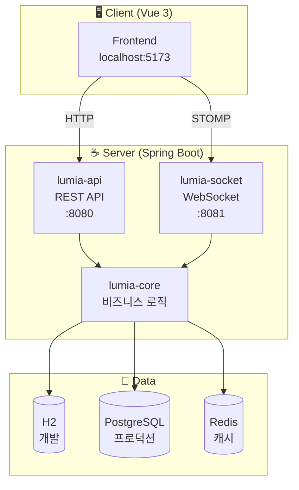
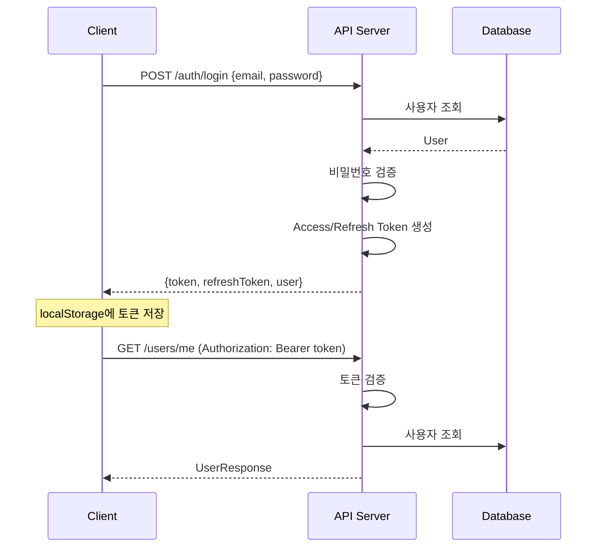
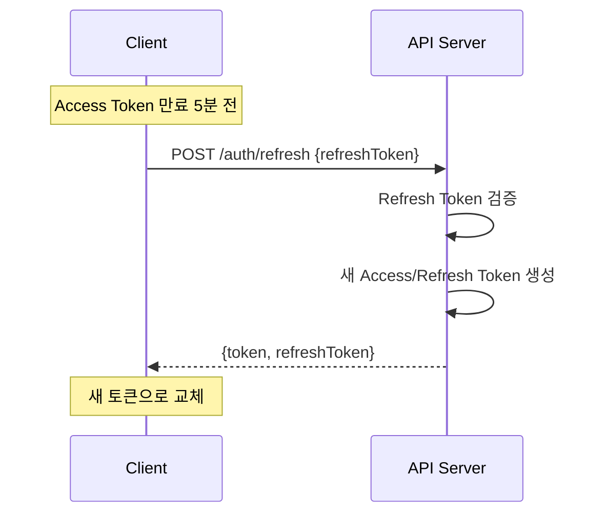
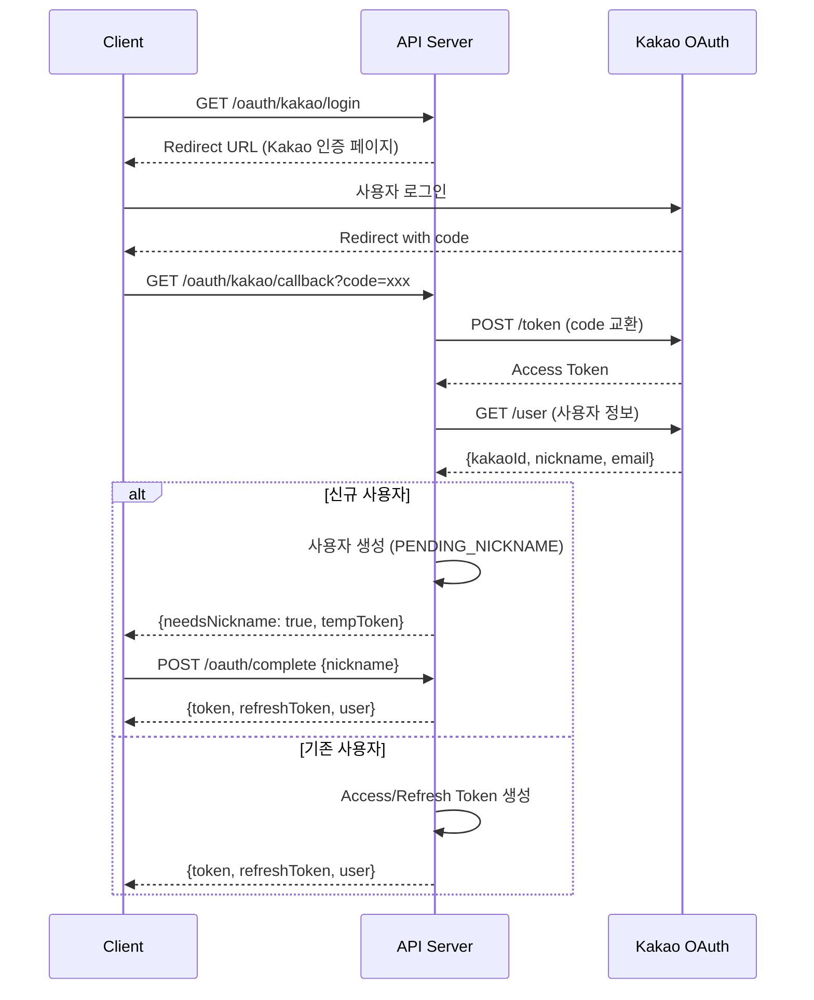
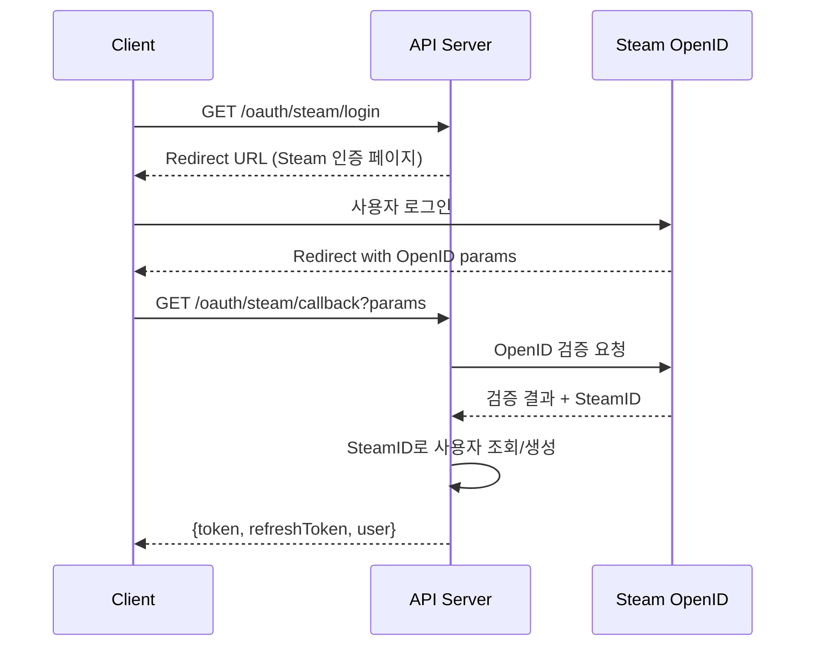
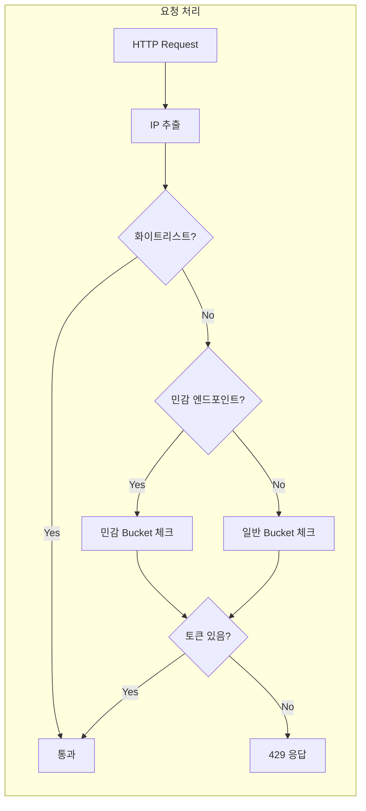
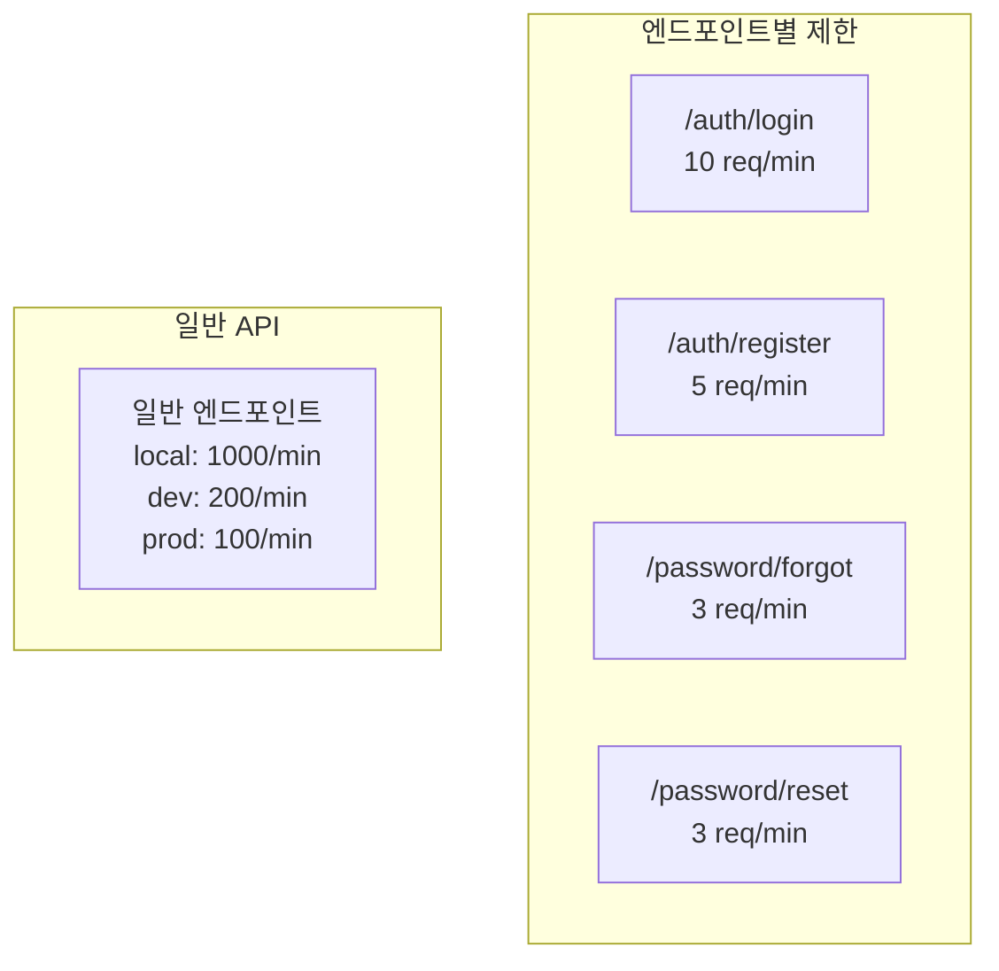
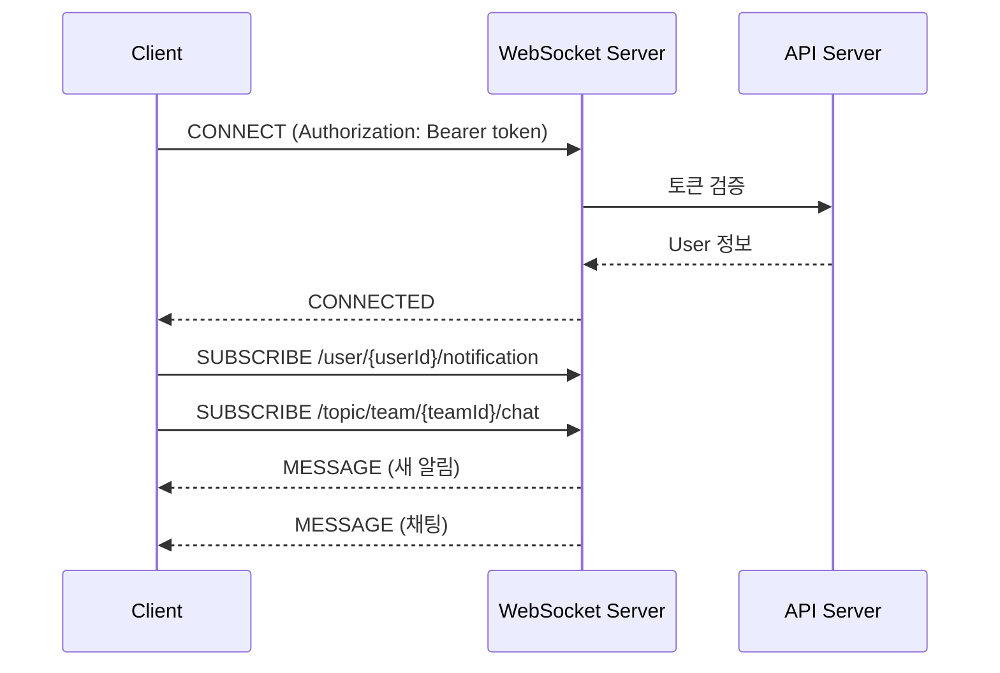
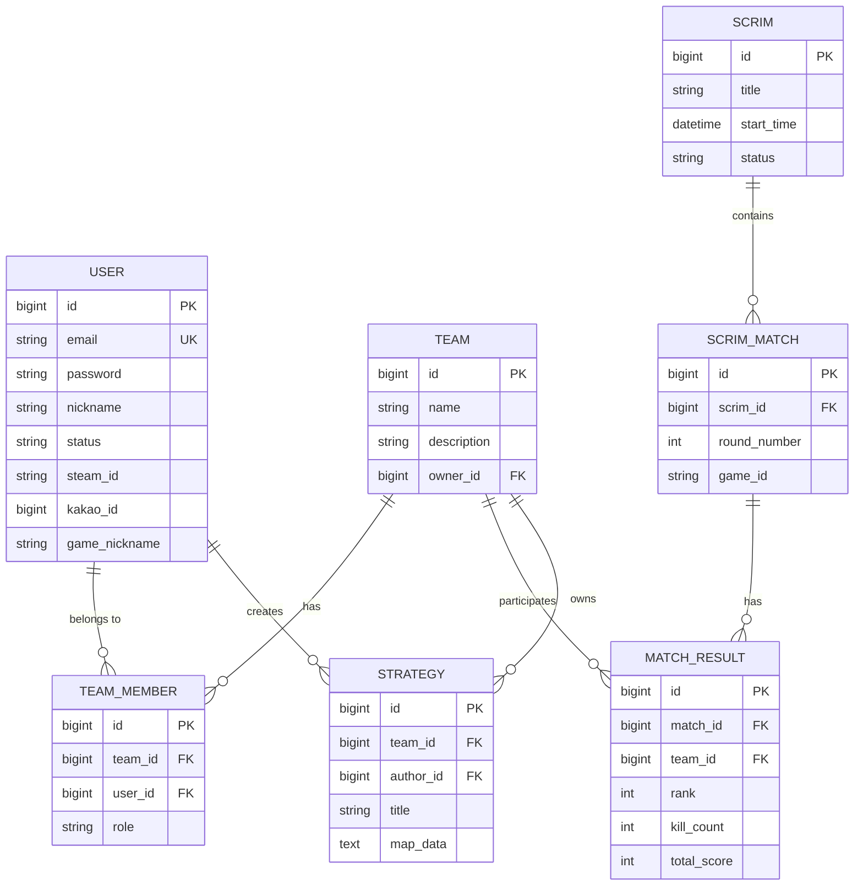

# 🏗️ 아키텍처 가이드

## 시스템 개요

Lumia Ops는 팀 기반 e스포츠 매니지먼트 플랫폼입니다.

---

## 📦 모듈 구조



---

## 🔐 인증 플로우

### JWT 로그인 플로우



### 토큰 갱신 플로우



### OAuth2 로그인 플로우 (Kakao)



### OAuth2 로그인 플로우 (Steam)



---

## 🚦 Rate Limiting 플로우

### Token Bucket 알고리즘



### 민감 엔드포인트 제한



### 응답 헤더

| 헤더 | 설명 |
|------|------|
| `X-Rate-Limit-Limit` | 허용된 최대 요청 수 |
| `X-Rate-Limit-Remaining` | 남은 요청 수 |
| `X-Rate-Limit-Retry-After-Seconds` | 재시도까지 대기 시간 |

---

## 📡 WebSocket 아키텍처

### STOMP 연결 플로우



### WebSocket 토픽

| 목적지 | 설명 |
|--------|------|
| `/user/{userId}/notification` | 개인 알림 |
| `/topic/team/{teamId}/chat` | 팀 채팅 |
| `/topic/strategy/{strategyId}` | 전략 실시간 동기화 |

---

## 🗃️ 데이터베이스 ERD



---

## 📁 디렉토리 구조

```
lumia-ops/
├── client/                      # Vue 3 Frontend
│   ├── src/
│   │   ├── api/                 # API 클라이언트
│   │   ├── components/          # Vue 컴포넌트
│   │   ├── composables/         # Vue Composables
│   │   ├── stores/              # Pinia 상태 관리
│   │   ├── views/               # 페이지 컴포넌트
│   │   └── utils/               # 유틸리티
│   └── package.json
│
├── server/                      # Spring Boot Backend
│   ├── lumia-api/               # REST API 모듈
│   │   ├── controller/          # 컨트롤러
│   │   ├── dto/                 # 요청/응답 DTO
│   │   └── security/            # 보안 설정
│   │
│   ├── lumia-core/              # 핵심 비즈니스 모듈
│   │   ├── domain/              # 엔티티
│   │   ├── repository/          # JPA Repository
│   │   └── service/             # 비즈니스 로직
│   │
│   └── lumia-socket/            # WebSocket 모듈
│       ├── controller/          # STOMP 컨트롤러
│       └── config/              # WebSocket 설정
│
└── .github/workflows/           # CI/CD
    └── ci.yml
```

---

## 🔧 기술 스택

| 영역 | 기술 |
|------|------|
| **Frontend** | Vue 3, TypeScript, Vite, Pinia |
| **Backend** | Spring Boot 3, Kotlin, JPA |
| **Database** | H2 (개발), PostgreSQL (프로덕션) |
| **Cache** | Redis |
| **WebSocket** | STOMP over SockJS |
| **Auth** | JWT (Access + Refresh Token) |
| **API Docs** | SpringDoc OpenAPI (Swagger) |
| **CI/CD** | GitHub Actions |
