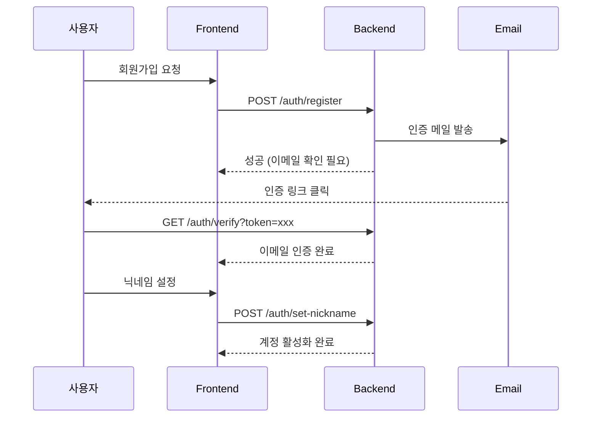
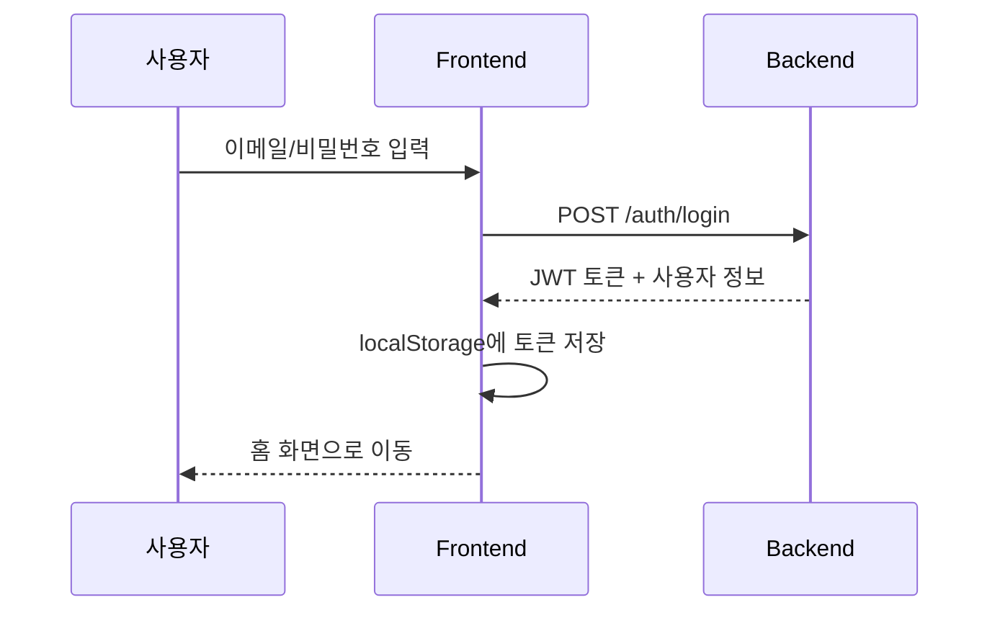

# 🔐 인증 시스템 가이드

## 개요

Lumia Ops는 JWT 기반 인증 시스템을 사용하며, 이메일 인증과 닉네임 설정 단계를 포함합니다.

---

## 📝 회원가입 흐름



### 계정 상태 (AccountStatus)

| 상태 | 설명 |
|------|------|
| `PENDING_VERIFICATION` | 이메일 인증 대기 |
| `PENDING_NICKNAME` | 닉네임 설정 대기 |
| `ACTIVE` | 정상 활성화 |
| `LOCKED` | 로그인 시도 초과로 잠금 |
| `INACTIVE` | 6개월 이상 미사용 |

---

## 🔑 로그인 흐름

### 정상 로그인


### 로그인 실패 시 처리

| 실패 사유 | 응답 코드 | 처리 |
|-----------|----------|------|
| 비밀번호 오류 | 401 | 실패 횟수 증가 |
| 5회 연속 실패 | 401 | 계정 잠금 (LOCKED) |
| 이메일 미인증 | 403 | 인증 메일 재발송 안내 |
| 6개월 미접속 | 403 | 비밀번호 재설정 필요 |

---

## 🎫 JWT 토큰 구조

### Access Token
- **유효기간:** 1시간
- **용도:** API 요청 인증
- **저장:** localStorage

### 토큰 검증 흐름
```
1. 요청 헤더에서 Authorization: Bearer <token> 추출
2. 토큰 서명 검증
3. 만료 여부 확인
4. userId 추출 → 사용자 조회
5. SecurityContext에 인증 정보 저장
```

---

## 📧 이메일 인증

### 인증 메일 발송
```bash
POST /auth/register
```
- 가입 시 자동으로 발송
- 인증 토큰 유효기간: 24시간

### 인증 확인
```bash
GET /auth/verify?token=<verification_token>
```

### 인증 메일 재발송
```bash
POST /auth/resend-verification
Body: { "email": "user@example.com" }
```

---

## 🔒 비밀번호 관리

### 비밀번호 찾기
```bash
POST /password/forgot
Body: { "email": "user@example.com" }
```
- 비밀번호 재설정 링크 이메일 발송
- 링크 유효기간: 1시간

### 비밀번호 재설정
```bash
POST /password/reset
Body: {
  "token": "reset_token",
  "newPassword": "newPassword123"
}
```

---

## 👤 닉네임 정책

### 최초 설정
- 이메일 인증 후 필수 설정
- 설정 후 계정 ACTIVE 상태로 전환

### 변경 제한
- 첫 설정 후 **한 달에 1회만** 변경 가능
- 마지막 변경일 기준으로 제한

---

## 🔓 계정 잠금 해제

### 잠금 조건
- 로그인 5회 연속 실패

### 해제 방법
1. 비밀번호 찾기 요청
2. 이메일로 받은 링크 클릭
3. 새 비밀번호 설정
4. 계정 자동 잠금 해제

---

## 🛠️ 관련 파일

### Backend
- `AuthController.kt` - 인증 API 엔드포인트
- `JwtTokenProvider.kt` - JWT 생성/검증
- `JwtAuthenticationFilter.kt` - 요청 인증 필터
- `SecurityConfig.kt` - Spring Security 설정
- `UserService.kt` - 사용자 비즈니스 로직

### Frontend
- `useAuth.ts` - 인증 컴포저블
- `api/auth.ts` - 인증 API 호출
- `stores/user.ts` - 사용자 상태 관리
- `router/index.ts` - 인증 가드
