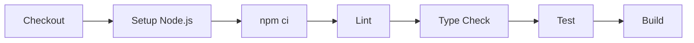

# 🔄 GitHub Actions CI 가이드

## 개요

이 프로젝트는 **GitHub Actions**를 사용하여 CI(Continuous Integration)를 자동화합니다.
PR을 생성하거나 `main`/`dev` 브랜치에 푸시하면 자동으로 빌드와 테스트가 실행됩니다.

---

## 📁 CI 설정 파일 위치

```
.github/workflows/ci.yml
```

---

## 🎯 CI 트리거 조건

| 이벤트 | 브랜치 | 동작 |
|-------|-------|------|
| **Push** | `main`, `dev` | CI 자동 실행 |
| **Pull Request** | `main`, `dev` 대상 | CI 자동 실행 |

---

## 🛠️ CI 파이프라인 구성

### Frontend (Vue.js + TypeScript)



**실행 명령어 (working-directory: ./client):**
```bash
npm ci              # 의존성 설치
npm run lint        # ESLint 검사
npm run type-check  # TypeScript 타입 검사
npm run test:run    # 테스트 실행
npm run build       # 프로덕션 빌드
```

### Backend (Spring Boot + Kotlin)


**실행 명령어 (working-directory: ./server):**
```bash
./gradlew build -x test  # 빌드 (테스트 제외)
./gradlew test           # 단위 테스트 실행
```

---

## 📋 로컬에서 CI 명령어 미리 실행하기

### Frontend
```bash
cd client
npm run lint         # 린트 오류 확인
npm run type-check   # 타입 오류 확인
npm run test:run     # 테스트 실행
npm run build        # 빌드 가능 여부 확인
```

### Backend
```bash
cd server
./gradlew build      # 빌드
./gradlew test       # 테스트
```

---

## 🔧 GitHub Actions working-directory 설정

GitHub Actions에서는 `cd` 명령어 대신 `working-directory`를 사용합니다.

### Job 레벨 설정 (현재 사용 중)
```yaml
jobs:
  frontend:
    runs-on: ubuntu-latest
    defaults:
      run:
        working-directory: ./client  # 모든 run에 적용
    steps:
      - run: npm ci        # ./client에서 실행됨
      - run: npm run build # ./client에서 실행됨
```

### Step 레벨 설정
```yaml
steps:
  - name: Build server
    working-directory: ./server
    run: ./gradlew build
```

> ⚠️ **주의:** 각 `run` 단계는 독립적이므로, `cd` 명령어는 해당 `run` 블록 내에서만 유효합니다.

---

## 🔍 CI 결과 확인 방법

1. GitHub 리포지토리로 이동
2. **Actions** 탭 클릭
3. 워크플로우 실행 결과 확인

**URL:** https://github.com/kimmyuung/lumia-ops/actions

---

## ❌ CI 실패 시 해결 방법

### 1. Frontend 린트 에러
```bash
cd client
npm run lint
```
→ ESLint 오류 수정 후 다시 푸시

### 2. Frontend 타입 에러
```bash
cd client
npm run type-check
```
→ 표시된 타입 오류 수정 후 다시 푸시

### 3. Frontend 테스트 실패
```bash
cd client
npm run test:run
```
→ 실패한 테스트 수정 후 다시 푸시

### 4. Backend 빌드 실패
```bash
cd server
./gradlew build --stacktrace
```
→ 컴파일 오류 확인 후 수정

### 5. Backend 테스트 실패
```bash
cd server
./gradlew test
```
→ 실패한 테스트 확인 후 수정

---

## 🌿 권장 개발 워크플로우

```
1. feature/* 브랜치에서 개발
   └─ git checkout -b feature/팀관리

2. 커밋 전 로컬에서 확인
   └─ npm run lint && npm run type-check (Frontend)
   └─ ./gradlew test (Backend)

3. dev 브랜치로 PR 생성
   └─ CI 자동 실행됨

4. CI 통과 + 코드 리뷰 후 병합

5. dev에서 충분히 테스트 후 main으로 병합
```

---

## ⚙️ CI 설정 수정 방법

`.github/workflows/ci.yml` 파일을 수정하면 됩니다.

**예: 테스트 커버리지 추가**
```yaml
- name: Test with Coverage
  run: npm run test:coverage
```

**예: 캐시 설정**
```yaml
- uses: actions/setup-node@v4
  with:
    node-version: '20'
    cache: 'npm'
    cache-dependency-path: './client/package-lock.json'
```
