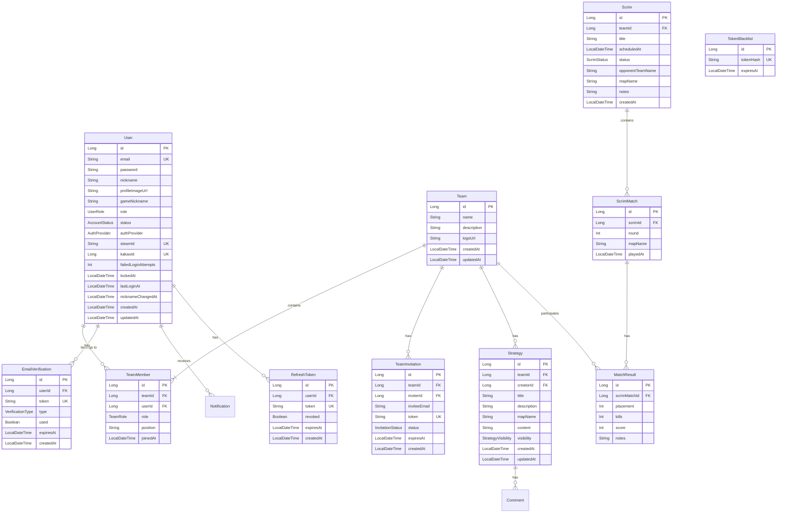

# 🗄️ 데이터베이스 스키마 가이드

## 개요

Lumia Ops는 JPA/Hibernate를 사용하며, 개발 시 H2, 프로덕션 시 PostgreSQL을 사용합니다.

---

## 📊 엔티티 관계도



---

## 📋 Enum 타입

### UserRole
| 값 | 설명 |
|----|------|
| `USER` | 일반 사용자 |
| `ADMIN` | 시스템 관리자 |

### AccountStatus
| 값 | 설명 |
|----|------|
| `PENDING_VERIFICATION` | 이메일 인증 대기 |
| `PENDING_NICKNAME` | 닉네임 설정 대기 |
| `ACTIVE` | 활성 |
| `LOCKED` | 잠금 |
| `INACTIVE` | 비활성 (6개월 미접속) |

### TeamRole
| 값 | 설명 |
|----|------|
| `OWNER` | 팀장 |
| `ADMIN` | 관리자 |
| `MEMBER` | 멤버 |

### InvitationStatus
| 값 | 설명 |
|----|------|
| `PENDING` | 대기 |
| `ACCEPTED` | 수락됨 |
| `DECLINED` | 거절됨 |
| `EXPIRED` | 만료됨 |
| `CANCELLED` | 취소됨 |

### ScrimStatus
| 값 | 설명 |
|----|------|
| `SCHEDULED` | 예정됨 |
| `IN_PROGRESS` | 진행 중 |
| `FINISHED` | 완료됨 |
| `CANCELLED` | 취소됨 |

### AuthProvider
| 값 | 설명 |
|----|------|
| `LOCAL` | 이메일/비밀번호 가입 |
| `STEAM` | Steam OpenID 로그인 |
| `KAKAO` | Kakao OAuth 로그인 |

### NotificationType
| 값 | 설명 |
|----|------|
| `TEAM_INVITE` | 팀 초대 |
| `TEAM_JOIN` | 팀 가입 알림 |
| `TEAM_LEAVE` | 팀 탈퇴 알림 |
| `SCRIM_SCHEDULED` | 스크림 예정 |
| `SCRIM_STARTED` | 스크림 시작 |
| `SCRIM_FINISHED` | 스크림 종료 |
| `MATCH_RESULT` | 매치 결과 등록 |
| `STRATEGY_SHARED` | 전략 공유됨 |
| `COMMENT_ADDED` | 코멘트 추가됨 |
| `GENERAL` | 일반 알림 |

### StrategyVisibility
| 값 | 설명 |
|----|------|
| `PUBLIC` | 공개 |
| `TEAM` | 팀 내 공개 |
| `PRIVATE` | 비공개 |

---

## 🔧 인덱스

### 정의된 인덱스

| 테이블 | 인덱스 | 컬럼 |
|--------|--------|------|
| `teams` | `idx_team_owner_id` | `owner_id` |
| `team_members` | `idx_team_member_team` | `team_id` |
| `team_members` | `idx_team_member_user` | `user_id` |
| `team_invitations` | `idx_invitation_token` (UK) | `token` |
| `team_invitations` | `idx_invitation_email_status` | `invited_email, status` |
| `scrims` | `idx_scrim_status` | `status` |
| `scrims` | `idx_scrim_start_time` | `start_time` |
| `notifications` | `idx_notification_user_read` | `user_id, is_read` |
| `notifications` | `idx_notification_created` | `created_at` |

### 자주 조회되는 컬럼
- `User.email` - 로그인 시 조회
- `User.steamId` - Steam OAuth 로그인
- `User.kakaoId` - Kakao OAuth 로그인
- `TeamMember.userId` - 사용자의 팀 조회
- `TeamMember.teamId` - 팀의 멤버 목록
- `TeamInvitation.token` - 초대 수락/거절
- `Scrim.status` - 상태별 스크림 필터링
- `Strategy.teamId` - 팀의 전략 목록
- `RefreshToken.token` - 토큰 갱신 시 조회
- `Notification.userId + isRead` - 읽지 않은 알림 조회

---

## 📁 관련 파일

### 엔티티
```
lumia-core/src/main/kotlin/com/lumiaops/lumiacore/domain/
├── User.kt
├── Team.kt
├── TeamMember.kt
├── TeamInvitation.kt
├── Scrim.kt
├── ScrimMatch.kt
├── MatchResult.kt
├── Strategy.kt
├── EmailVerification.kt
├── RefreshToken.kt
└── TokenBlacklist.kt
```

### 리포지토리
```
lumia-core/src/main/kotlin/com/lumiaops/lumiacore/repository/
├── UserRepository.kt
├── TeamRepository.kt
├── TeamMemberRepository.kt
├── TeamInvitationRepository.kt
├── ScrimRepository.kt
├── ScrimMatchRepository.kt
├── MatchResultRepository.kt
├── StrategyRepository.kt
└── EmailVerificationRepository.kt
```
