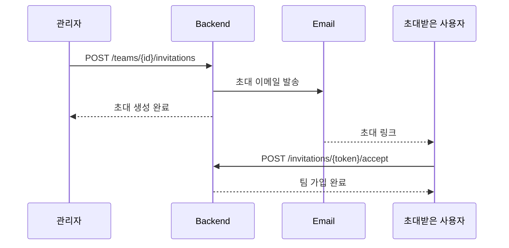

# 👥 팀 관리 가이드

## 개요

Lumia Ops에서 팀은 스크림과 전략을 관리하는 기본 단위입니다.
사용자는 하나의 팀에만 소속될 수 있습니다.

---

## 🏗️ 팀 생성

### API
```bash
POST /teams
Authorization: Bearer <token>
Body: {
  "name": "팀 이름",
  "description": "팀 설명 (선택)"
}
```

### 생성 규칙
- 팀 이름: 2자 이상
- 생성자는 자동으로 OWNER 역할 부여
- 이미 팀에 소속된 경우 생성 불가

---

## 👑 팀 역할 (TeamRole)

| 역할 | 권한 |
|------|------|
| `OWNER` | 모든 권한 (팀 삭제, 역할 변경 포함) |
| `ADMIN` | 멤버 초대/제거, 팀 정보 수정 |
| `MEMBER` | 조회만 가능 |

---

## 📨 팀 초대 흐름



### 초대 생성
```bash
POST /teams/{teamId}/invitations
Body: { "email": "newmember@example.com" }
```

### 초대 수락
```bash
POST /invitations/{token}/accept
```

### 초대 거절
```bash
POST /invitations/{token}/decline
```

### 초대 상태 (InvitationStatus)

| 상태 | 설명 |
|------|------|
| `PENDING` | 대기 중 |
| `ACCEPTED` | 수락됨 |
| `DECLINED` | 거절됨 |
| `EXPIRED` | 만료됨 (7일) |
| `CANCELLED` | 취소됨 |

---

## 👤 멤버 관리

### 멤버 목록 조회
```bash
GET /teams/{teamId}/members
```

### 멤버 제거
```bash
DELETE /teams/{teamId}/members/{memberId}
```
- OWNER, ADMIN만 가능
- OWNER는 제거 불가

### 역할 변경
```bash
PATCH /teams/{teamId}/members/{memberId}/role
Body: { "role": "ADMIN" }
```
- OWNER만 가능

---

## 🚪 팀 탈퇴

### 일반 멤버 탈퇴
```bash
DELETE /teams/{teamId}/members/me
```

### OWNER 탈퇴 제한
- OWNER는 직접 탈퇴 불가
- 다른 멤버에게 OWNER 이전 후 탈퇴 가능
- 또는 팀 삭제

---

## 🗑️ 팀 삭제

```bash
DELETE /teams/{teamId}
```

### 삭제 조건
- OWNER만 가능
- 팀 삭제 시 모든 멤버 탈퇴 처리
- 관련 스크림, 전략 데이터도 삭제

---

## 🔄 Frontend 컴포넌트

### 팀 관리 화면
- `TeamView.vue` - 메인 팀 관리 페이지
- `TeamFormModal.vue` - 팀 생성/수정 모달
- `TeamInviteModal.vue` - 멤버 초대 모달
- `TeamJoinModal.vue` - 초대 코드로 참여 모달
- `PendingInvitations.vue` - 대기 중인 초대 목록

### 초대 관련
- `InvitationsView.vue` - 내게 온 초대 목록
- `AcceptInvitationView.vue` - 초대 수락 페이지

---

## 📊 관련 엔티티

```
Team
├── id
├── name
├── description
├── logoUrl
├── createdAt
├── updatedAt
└── members[] ─────┐
                   │
TeamMember         │
├── id             │
├── teamId ◄───────┘
├── userId
├── nickname
├── role (OWNER/ADMIN/MEMBER)
├── position
└── joinedAt
```

---

## 🛠️ 관련 파일

### Backend
- `TeamController.kt` - 팀 API
- `InvitationController.kt` - 초대 API
- `TeamService.kt` - 팀 비즈니스 로직
- `TeamInvitationService.kt` - 초대 로직

### Frontend
- `stores/team.ts` - 팀 상태 관리
- `api/team.ts` - 팀 API 호출
- `api/invitation.ts` - 초대 API 호출
