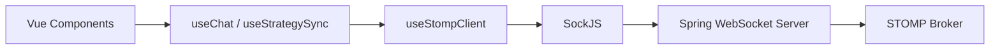

# 🔌 WebSocket 가이드

## 개요

Lumia Ops는 **STOMP over WebSocket**을 사용하여 실시간 기능을 제공합니다.
- 채팅
- 전략 맵 동기화
- 알림

---

## 🏗️ 아키텍처



### 기술 스택
| 계층 | 기술 |
|------|------|
| **Frontend** | @stomp/stompjs, sockjs-client |
| **Backend** | Spring WebSocket, STOMP |
| **폴백** | SockJS (WebSocket 미지원 시) |

---

## 📁 관련 파일

### Frontend (Composables)
```
client/src/composables/
├── useStompClient.ts   # 핵심 STOMP 클라이언트
├── useChat.ts          # 채팅 기능
└── useStrategySync.ts  # 전략 동기화
```

### Backend (lumia-socket 모듈)
```
server/lumia-socket/src/main/kotlin/
├── config/WebSocketConfig.kt         # WebSocket 설정
├── controller/
│   ├── ChatController.kt             # 채팅 메시지 핸들러
│   ├── StrategyWebSocketController.kt # 전략 동기화 핸들러
│   └── NotificationController.kt     # 알림 핸들러
├── dto/
│   ├── ChatMessage.kt
│   └── StrategyMessage.kt
└── listener/WebSocketEventListener.kt
```

---

## 🔗 연결 설정

### WebSocket 엔드포인트
```
http://localhost:8081/ws
```

### Frontend 연결 방법

```typescript
import { useStompClient } from '@/composables/useStompClient'

const { connect, isConnected, error } = useStompClient({
    url: 'http://localhost:8081/ws',
    token: authStore.token,  // JWT 토큰 (선택)
    onConnect: () => console.log('Connected!'),
    onDisconnect: () => console.log('Disconnected'),
    onError: (err) => console.error(err)
})

connect()
```

---

## 🔄 지수 백오프 재연결

연결이 끊어지면 자동으로 재연결을 시도합니다.

| 시도 | 딜레이 |
|------|--------|
| 1 | ~1초 |
| 2 | ~2초 |
| 3 | ~4초 |
| 4 | ~8초 |
| 5 | ~16초 |
| 6+ | ~30초 (최대) |

- **최대 재연결 시도:** 10회
- **지터(Jitter):** ±10% (썬더링 허드 방지)
- **연결 성공 시:** 시도 횟수 초기화

---

## 💬 채팅 기능

### 사용법

```typescript
import { useChat } from '@/composables/useChat'

const { 
    connect, 
    joinRoom, 
    leaveRoom, 
    sendMessage, 
    messages, 
    isConnected 
} = useChat({
    url: 'http://localhost:8081/ws',
    token: authStore.token
})

// 연결
connect()

// 채팅방 입장
joinRoom('room-123', 'username', userId)

// 메시지 전송
sendMessage('Hello, team!')

// 채팅방 퇴장
leaveRoom()
```

### STOMP Destinations

| 구독/전송 | Destination | 설명 |
|-----------|-------------|------|
| **구독** | `/topic/chat.{roomId}` | 채팅 메시지 수신 |
| **전송** | `/app/chat.send/{roomId}` | 메시지 전송 |
| **전송** | `/app/chat.join/{roomId}` | 방 입장 |
| **전송** | `/app/chat.leave/{roomId}` | 방 퇴장 |

### 메시지 타입

```typescript
interface ChatMessage {
    type: 'JOIN' | 'LEAVE' | 'CHAT'
    roomId: string
    sender: string
    senderId?: number
    content: string
    timestamp: string
}
```

---

## 🗺️ 전략 맵 동기화

### 사용법

```typescript
import { useStrategySync } from '@/composables/useStrategySync'

const { 
    connect, 
    joinStrategy, 
    leaveStrategy, 
    sendUpdate, 
    shareCursor,
    participants 
} = useStrategySync({
    url: 'http://localhost:8081/ws',
    onUpdate: (msg) => applyChange(msg),
    onCursorMove: (cursor) => showCursor(cursor),
    onParticipantJoin: (user) => addParticipant(user)
})

// 연결
connect()

// 전략 세션 참여
joinStrategy('strategy-id', userId, 'username')

// 변경사항 전송
sendUpdate('UPDATE', { 
    elementId: 'marker-1', 
    position: { x: 100, y: 200 } 
})

// 커서 위치 공유
shareCursor(mouseX, mouseY)

// 세션 떠나기
leaveStrategy()
```

### STOMP Destinations

| 구독/전송 | Destination | 설명 |
|-----------|-------------|------|
| **구독** | `/topic/strategy.{strategyId}` | 전략 업데이트 수신 |
| **구독** | `/topic/strategy.{strategyId}.cursor` | 커서 위치 수신 |
| **전송** | `/app/strategy.update/{strategyId}` | 변경사항 전송 |
| **전송** | `/app/strategy.cursor/{strategyId}` | 커서 위치 전송 |

### 메시지 타입

```typescript
// 전략 업데이트
interface StrategyUpdateMessage {
    type: 'JOIN' | 'LEAVE' | 'UPDATE' | 'DELETE'
    strategyId: string
    userId: number
    username: string
    data?: any
    timestamp: string
}

// 커서 위치
interface CursorPosition {
    strategyId: string
    userId: number
    username: string
    x: number
    y: number
    timestamp: string
}
```

---

## 🔐 인증

### JWT 토큰 전달

```typescript
useStompClient({
    url: 'http://localhost:8081/ws',
    token: authStore.token  // Ref<string> 또는 string
})
```

STOMP 연결 시 Authorization 헤더로 전송됩니다:
```
Authorization: Bearer <jwt_token>
```

### 토큰 폴백
1. 전달된 token 파라미터
2. localStorage의 'token' 키

---

## 🛠️ 디버깅

### 콘솔 로그

STOMP 클라이언트는 자동으로 로그를 출력합니다:

```
[STOMP] Connected
[STOMP] Reconnection attempt 1/10
[STOMP] WebSocket error. Reconnecting in 2000ms (attempt 1/10)
[STOMP] Max reconnection attempts reached
[STOMP] Disconnected
```

### 개발 도구

1. **Chrome DevTools > Network > WS** 탭에서 WebSocket 메시지 확인
2. STOMP 프레임 내용 확인 가능

---

## ⚠️ 트러블슈팅

### 연결 안됨
```
1. 백엔드 서버 실행 확인 (포트 8081)
2. CORS 설정 확인 (WebSocketConfig.kt)
3. SockJS 엔드포인트 확인 (/ws)
```

### 메시지 수신 안됨
```
1. 올바른 destination 구독 확인
2. 구독 전 연결 상태 확인 (isConnected)
3. JSON 파싱 오류 확인
```

### 401 Unauthorized
```
1. JWT 토큰 유효성 확인
2. 토큰 만료 여부 확인
3. Authorization 헤더 포함 여부 확인
```

---

## 📋 Backend 설정 예시

### WebSocketConfig.kt

```kotlin
@Configuration
@EnableWebSocketMessageBroker
class WebSocketConfig : WebSocketMessageBrokerConfigurer {

    override fun configureMessageBroker(config: MessageBrokerRegistry) {
        config.enableSimpleBroker("/topic", "/queue")
        config.setApplicationDestinationPrefixes("/app")
    }

    override fun registerStompEndpoints(registry: StompEndpointRegistry) {
        registry.addEndpoint("/ws")
            .setAllowedOriginPatterns("*")
            .withSockJS()
    }
}
```

### ChatController.kt

```kotlin
@Controller
class ChatController {

    @MessageMapping("/chat.send/{roomId}")
    @SendTo("/topic/chat.{roomId}")
    fun sendMessage(
        @DestinationVariable roomId: String,
        message: ChatMessage
    ): ChatMessage {
        return message.copy(timestamp = Instant.now().toString())
    }
}
```
