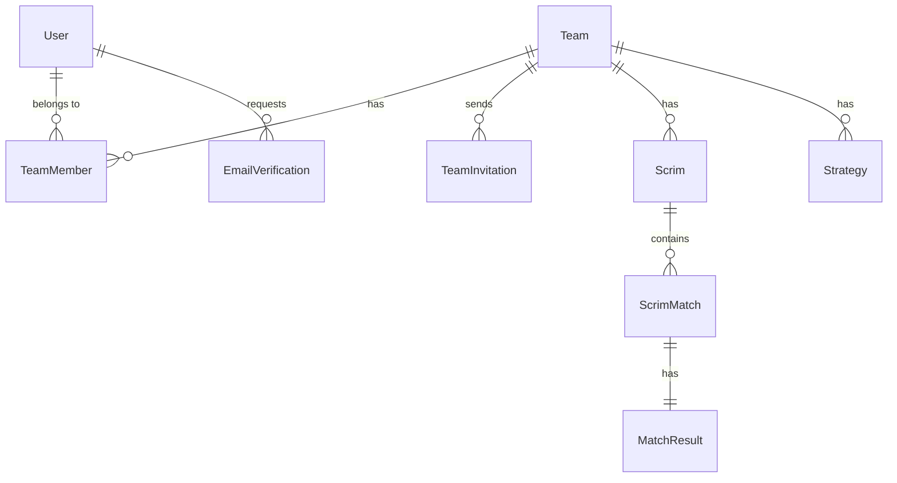

# Lumia Ops

> **e스포츠 팀 운영 플랫폼** - 팀 관리, 스크림 매칭, 전략 공유를 위한 통합 솔루션


---

## 📋 프로젝트 개요

Lumia Ops는 e스포츠 팀의 효율적인 운영을 지원하는 웹 플랫폼입니다. 팀 구성원 관리, 스크림(연습 경기) 일정 관리, 전략 공유 등의 기능을 제공합니다.

## 🏗️ 프로젝트 구조

```
lumia-ops/
├── client/                 # 프론트엔드 (Vue.js)
│   ├── src/
│   │   ├── api/           # API 호출 모듈
│   │   ├── components/    # Vue 컴포넌트
│   │   ├── composables/   # Vue Composables
│   │   ├── router/        # Vue Router 설정
│   │   ├── stores/        # Pinia 스토어
│   │   ├── types/         # TypeScript 타입 정의
│   │   ├── utils/         # 유틸리티 함수
│   │   └── views/         # 페이지 뷰
│   └── ...
│
├── server/                 # 백엔드 (Kotlin/Spring Boot)
│   ├── lumia-core/        # 핵심 비즈니스 로직
│   │   ├── domain/        # 도메인 엔티티
│   │   ├── repository/    # JPA Repository
│   │   └── service/       # 비즈니스 서비스
│   ├── lumia-api/         # REST API 레이어
│   │   ├── controller/    # REST Controllers
│   │   └── dto/           # Data Transfer Objects
│   └── lumia-socket/      # WebSocket 모듈
│
└── .github/workflows/      # CI/CD 파이프라인
```

## ✨ 주요 기능

### 🔐 인증 시스템
- 이메일 기반 회원가입 및 로그인
- 이메일 인증 (회원가입, 비밀번호 재설정)
- 닉네임 설정 및 변경 (월 1회 제한)
- 계정 보안 (5회 로그인 실패 시 잠금)
- 6개월 미활동 계정 재인증

### 👥 팀 관리
- 팀 생성 및 관리
- 팀원 초대 (이메일 기반)
- 역할 기반 권한 관리

### ⚔️ 스크림 관리
- 스크림 일정 생성 및 관리
- 매치 결과 기록
- 경기 히스토리 추적

### 📊 전략 관리
- 전략 문서 작성 및 공유
- 팀별 전략 라이브러리

## 🛠️ 기술 스택

### Backend
| 기술 | 버전 | 설명 |
|------|------|------|
| Kotlin | 2.0.0 | 주 개발 언어 |
| Spring Boot | 3.4.1 | 웹 프레임워크 |
| Spring Data JPA | - | ORM |
| Java | 21 | 런타임 |
| Gradle | - | 빌드 도구 |

### Frontend
| 기술 | 버전 | 설명 |
|------|------|------|
| Vue.js | 3.5 | UI 프레임워크 |
| TypeScript | 5.9 | 타입 시스템 |
| Vite | 7.2 | 빌드 도구 |
| Pinia | 3.0 | 상태 관리 |
| Vue Router | 4.6 | 라우팅 |
| Axios | 1.13 | HTTP 클라이언트 |
| Lucide Icons | 0.562 | 아이콘 라이브러리 |
| Vitest | 4.0 | 테스트 프레임워크 |

## 🚀 시작하기

### 사전 요구사항
- Java 21+
- Node.js 18+
- npm 또는 yarn

### 백엔드 실행

```bash
cd server
./gradlew bootRun
```

### 프론트엔드 실행

```bash
cd client
npm install
npm run dev
```

### 테스트 실행

```bash
# 백엔드 테스트
cd server
./gradlew test

# 프론트엔드 테스트
cd client
npm run test
```

## 📁 도메인 모델



### 주요 엔티티
- **User**: 사용자 계정 (이메일, 닉네임, 계정 상태)
- **Team**: e스포츠 팀
- **TeamMember**: 팀-사용자 관계 (역할 포함)
- **TeamInvitation**: 팀 초대
- **Scrim**: 스크림(연습 경기) 일정
- **ScrimMatch**: 개별 매치
- **MatchResult**: 매치 결과
- **Strategy**: 팀 전략 문서

## 🔧 개발 환경 설정

### 환경 변수

클라이언트 환경 변수 (`.env` 파일):
```env
VITE_API_BASE_URL=http://localhost:8080
```

## 📝 API 엔드포인트

### 인증
| Method | Endpoint | 설명 |
|--------|----------|------|
| POST | `/api/auth/register` | 회원가입 |
| POST | `/api/auth/login` | 로그인 |
| POST | `/api/auth/verify-email` | 이메일 인증 |

### 비밀번호
| Method | Endpoint | 설명 |
|--------|----------|------|
| POST | `/api/password/forgot` | 비밀번호 찾기 |
| POST | `/api/password/reset` | 비밀번호 재설정 |

### 초대
| Method | Endpoint | 설명 |
|--------|----------|------|
| POST | `/api/invitations` | 초대 생성 |
| GET | `/api/invitations/received` | 받은 초대 조회 |
| POST | `/api/invitations/:id/accept` | 초대 수락 |
| POST | `/api/invitations/:id/decline` | 초대 거절 |

## 🧪 CI/CD

GitHub Actions를 통한 자동화된 CI 파이프라인이 구성되어 있습니다:
- 빌드 검증
- 테스트 실행
- 코드 품질 검사

## 📄 라이선스

This project is private and proprietary.

---

<div align="center">
  <sub>Built with ❤️ for e-sports teams</sub>
</div>
